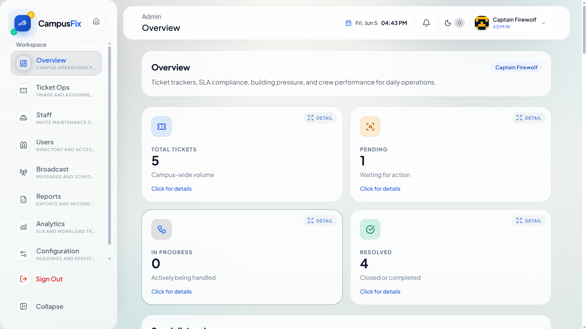
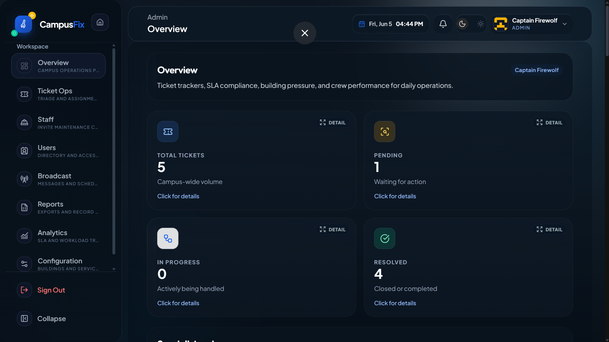
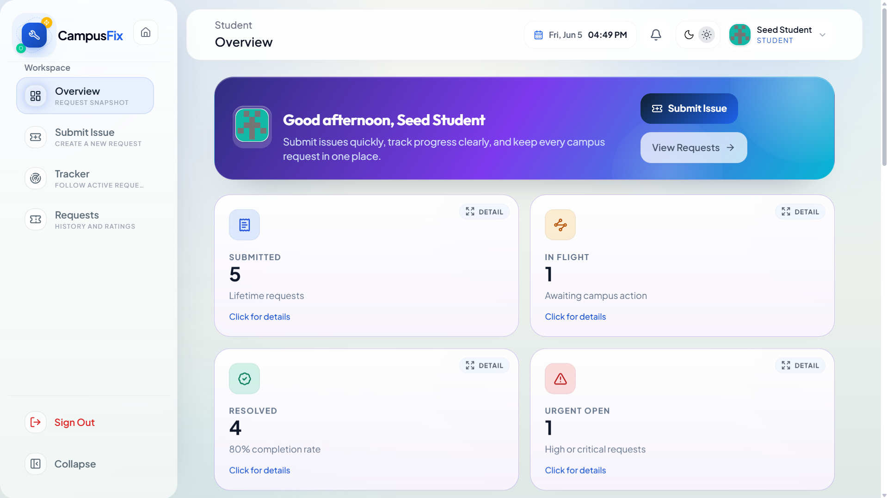
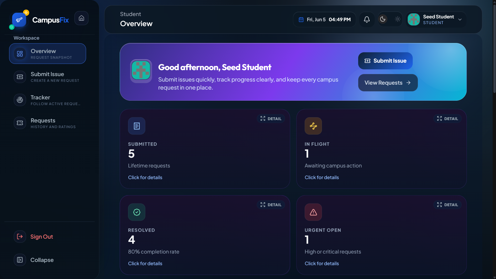
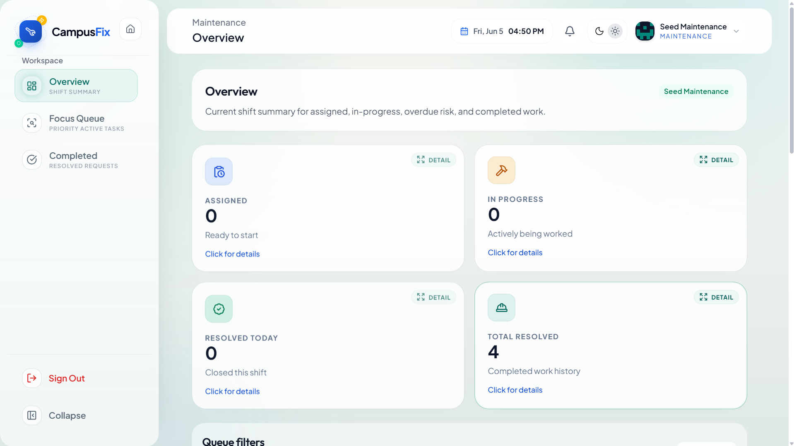
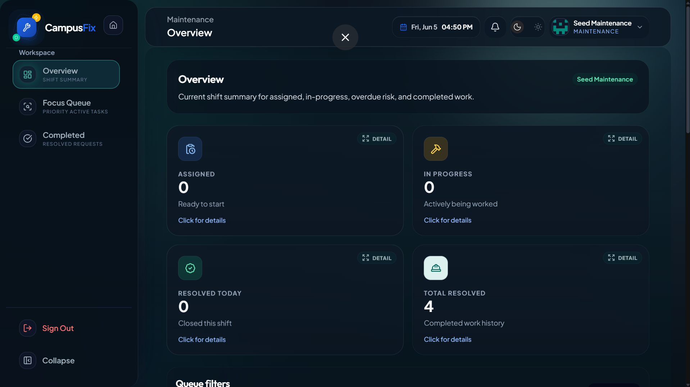

# CampusFix

CampusFix is a role-based campus maintenance platform for students, maintenance staff, and administrators. It centralizes issue reporting, ticket tracking, work assignment, SLA visibility, and operational reporting in one responsive web application.

## Dashboards

| Role | Light Mode | Dark Mode |
| --- | --- | --- |
| Admin dashboard: tracks ticket volume, SLA compliance, building pressure, users, staff, broadcasts, reports, and analytics. |  |  |
| Student dashboard: helps students submit issues, track active requests, review history, and monitor urgent or resolved items. |  |  |
| Maintenance dashboard: summarizes assigned work, in-progress tasks, overdue risk, and completed maintenance requests. |  |  |

## Core Features

- Role-based dashboards for students, technicians, and administrators
- Ticket creation, assignment, status tracking, comments, ratings, and attachments
- Admin tools for users, staff onboarding, broadcasts, reports, catalog configuration, and analytics
- Maintenance queues for active work, completed requests, and shift-level summaries
- Email, notification, audit, rate-limit, and deployment-ready configuration support

## Tech Stack

- Backend: Java 21, Spring Boot, Maven, MySQL, Flyway
- Frontend: React, Vite, Tailwind CSS
- DevOps: Docker Compose, production Dockerfiles, Kubernetes manifests

## Prerequisites

- Java 21+
- Maven 3.9+
- Node.js 18+
- MySQL 8.0+

## Running Locally

### 1. Database

Run the Flyway migrations automatically on first backend startup. No manual SQL import is required.

If you prefer to pre-create the database manually:

```bash
mysql -u root -p -e "CREATE DATABASE IF NOT EXISTS Campus_Fix CHARACTER SET utf8mb4;"
```

### 2. Backend

```powershell
cd backend
copy .env.example .env
```

Edit `.env` and set at minimum:

```env
DB_URL=jdbc:mysql://localhost:3306/Campus_Fix
DB_USERNAME=root
DB_PASSWORD=yourpassword
APP_SEED_BOOTSTRAP_ADMIN=true
APP_ADMIN_USERNAME=admin
APP_ADMIN_EMAIL=admin@campus.local
APP_ADMIN_PASSWORD=YourStrongPassword123!
APP_EMAIL_ENABLED=false
```

Start the backend:

```powershell
mvn spring-boot:run -DskipTests
```

Backend runs at `http://localhost:8080`.

Tip: use the `fast` profile during development to speed up startup:

```powershell
mvn spring-boot:run -DskipTests "-Dspring-boot.run.profiles=fast"
```

### 3. Frontend

Open a second terminal:

```powershell
cd frontend
npm install
npm run dev
```

Frontend runs at `http://localhost:5173`.

## Default Admin Account

The default admin account is configured through `backend/.env`. See the `APP_ADMIN_*` variables above. The account is created automatically on first startup when `APP_SEED_BOOTSTRAP_ADMIN=true`.

## Email

Email is disabled by default with `APP_EMAIL_ENABLED=false`. To enable it for local testing, configure SMTP in `.env`:

```env
APP_EMAIL_ENABLED=true
MAIL_HOST=smtp.example.com
MAIL_USERNAME=your-user
MAIL_PASSWORD=your-password
APP_EMAIL_FROM=no-reply@yourdomain.com
```

## Docker

```powershell
copy backend/.env.example backend/.env
# Edit backend/.env with strong secrets
docker compose up --build
```

| Service | URL |
| --- | --- |
| Backend | `http://localhost:8080` |
| Frontend | `http://localhost:3000` |
| MySQL | `localhost:3306` |

## Project Structure

```text
backend/          Spring Boot API
frontend/         React + Vite web app
database/         Schema and seed data
documentation/    Architecture, API, setup, testing, and deployment guides
devops/           Docker and Kubernetes deployment assets
uploads/          Runtime file upload storage
```
