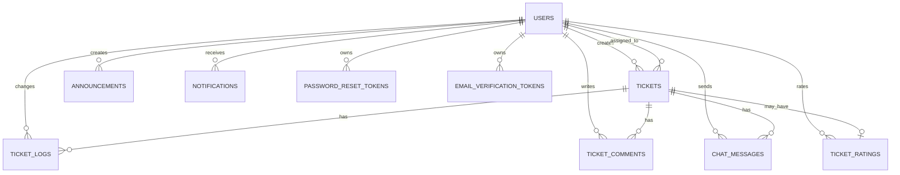

# CampusFix ERD Summary

Database: `Campus_Fix`

## Core Relationships

## Main Tables

- `users`
- `tickets`
- `ticket_logs`
- `ticket_comments`
- `chat_messages`
- `ticket_ratings`
- `announcements`
- `notifications`
- `support_requests`
- `password_reset_tokens`
- `email_verification_tokens`
- `buildings`
